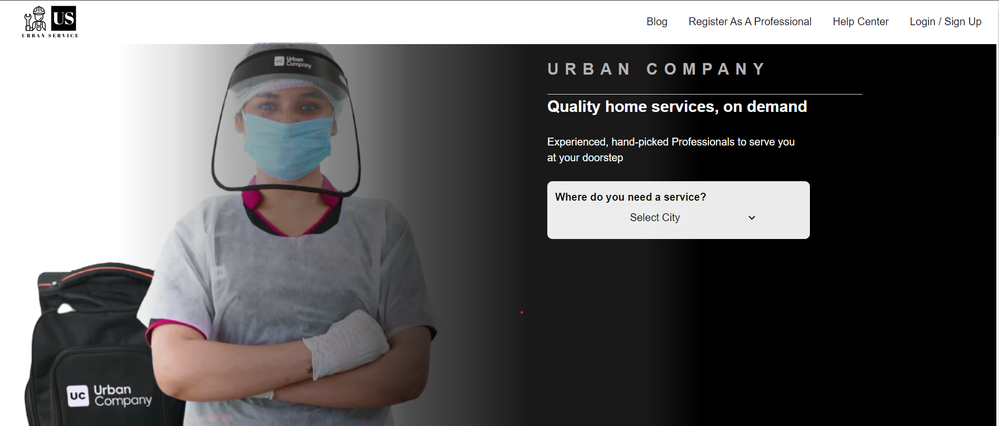
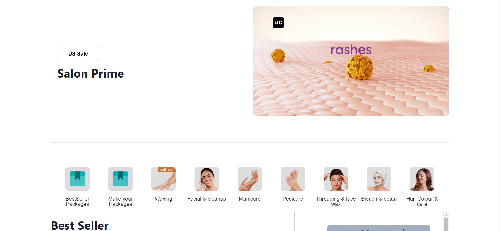

Here are some snapshots of the live site 

import React, { useState } from 'react';
import { Box, FormControl, FormLabel, Input, Select, Button, Checkbox, Text, useToast } from "@chakra-ui/core";

const RegisterForm = () => {
  const [formData, setFormData] = useState({
    firstName: '',
    middleName: '',
    lastName: '',
    gender: '',
    dob: '',
    password: '',
    confirmPassword: '',
    agreed: false,
  });
  const [errors, setErrors] = useState({});
  const toast = useToast();

  const handleChange = (e) => {
    setFormData({ ...formData, [e.target.name]: e.target.value });
  };

  const handleCheckboxChange = (e) => {
    setFormData({ ...formData, agreed: e.target.checked });
  };

  const handleSubmit = (e) => {
    e.preventDefault();
    const validationErrors = validateForm(formData);
    setErrors(validationErrors);

    if (Object.keys(validationErrors).length === 0 && formData.agreed) {
      console.log(formData);
      toast({
        title: "Registration successful!",
        description: "Thank you for registering!",
        status: "success",
        duration: 5000,
        isClosable: true,
      });
    }
  };

  const validateForm = (data) => {
    const errors = {};
    if (!data.firstName) errors.firstName = "First name is required.";
    if (!data.lastName) errors.lastName = "Last name is required.";
    if (!data.gender) errors.gender = "Gender is required.";
    if (!data.dob) errors.dob = "Date of birth is required.";
    if (!data.password) errors.password = "Password is required.";
    if (!data.confirmPassword) errors.confirmPassword = "Confirm password is required.";
    if (data.password !== data.confirmPassword) {
      errors.confirmPassword = "Passwords do not match.";
    }
    const regex = /^(?=.*[A-Z])(?=.*[!@#$%^&*()_+\-=\[\]{};':"\\|,.<>\/?])(?=.*[0-9])(?=.*[a-z]).{8,}$/;
    if (!regex.test(data.password)) {
      errors.password = "Password must contain at least one uppercase letter, one special character, and one number.";
    }
    if (!data.agreed) errors.agreed = "Please agree to the terms and conditions.";
    return errors;
  };

  return (
    <Box p={4}>
      <form onSubmit={handleSubmit}>
        <FormControl mb={3} isInvalid={errors.firstName}>
          <FormLabel htmlFor="firstName">First Name</FormLabel>
          <Input type="text" id="firstName" name="firstName" value={formData.firstName} onChange={handleChange} />
          {errors.firstName && <Text color="red.500">{errors.firstName}</Text>}
        </FormControl>
        <FormControl mb={3} isInvalid={errors.middleName}>
          <FormLabel htmlFor="middleName">Middle Name</FormLabel>
          <Input type="text" id="middleName" name="middleName" value={formData.middleName} onChange={handleChange} />
        </FormControl>
        <FormControl mb={3} isInvalid={errors.lastName}>
          <FormLabel htmlFor="lastName">Last Name</FormLabel>
          <Input type="text" id="lastName" name="lastName" value={formData.lastName} onChange={handleChange} />
          {errors.lastName && <Text color="red.500">{errors.lastName}</Text>}
        </FormControl>
        <FormControl mb={3} isInvalid={errors.gender}>
          <FormLabel htmlFor="gender">

New chat

suraj pawar
input field 
fierst name last name and middle name   
gender select
date of birth  and select date pass word and confirm password 1 letter Upper case and one specil character
 and checkbox 
without checkbox form not submit

and after the form submission show data in console also use validation plugins show success massage on successful register  and validation massage will be all fileds are mandorty usimg chakra ui

Sure, I can help you with that. Here's an HTML form code that includes the input fields you mentioned, as well as Chakra UI components for styling and validation:

php
Copy code
<!DOCTYPE html>
<html>
<head>
  <meta charset="UTF-8">
  <title>Registration Form</title>
  <link rel="stylesheet" href="https://unpkg.com/@

suraj pawar
input field 
fierst name last name and middle name   
gender select
date of birth  and select date pass word and confirm password 1 letter Upper case and one specil character
 and checkbox 
without checkbox form not submit

and after the form submission show data in console also use validation plugins show success massage on successful register  and validation massage will be all fileds are mandatory using react

Sure, here's an example React code for the form you described:

php
Copy code
import React, { useState } from 'react';
import { Box, FormControl, FormLabel, Input, Select, Button, Checkbox, Text, useToast } from "@chakra-ui/core";

const RegisterForm = () => {
  const [formData, setFormData] = useState({
    firstName: '',
    middleName: '',
    lastName: '',
    gender: '',
    dob: '',
    password: '',
    confirmPassword: '',
    agreed: false,
  });
  const [errors, setErrors] = useState({});
  const toast = useToast();

  const handleChange = (e) => {
    setFormData({ ...formData, [e.target.name]: e.target.value });
  };

  const handleCheckboxChange = (e) => {
    setFormData({ ...formData, agreed: e.target.checked });
  };

  const handleSubmit = (e) => {
    e.preventDefault();
    const validationErrors = validateForm(formData);
    setErrors(validationErrors);

    if (Object.keys(validationErrors).length === 0 && formData.agreed) {
      console.log(formData);
      toast({
        title: "Registration successful!",
        description: "Thank you for registering!",
        status: "success",
        duration: 5000,
        isClosable: true,
      });
    }
  };

  const validateForm = (data) => {
    const errors = {};
    if (!data.firstName) errors.firstName = "First name is required.";
    if (!data.lastName) errors.lastName = "Last name is required.";
    if (!data.gender) errors.gender = "Gender is required.";
    if (!data.dob) errors.dob = "Date of birth is required.";
    if (!data.password) errors.password = "Password is required.";
    if (!data.confirmPassword) errors.confirmPassword = "Confirm password is required.";
    if (data.password !== data.confirmPassword) {
      errors.confirmPassword = "Passwords do not match.";
    }
    const regex = /^(?=.*[A-Z])(?=.*[!@#$%^&*()_+\-=\[\]{};':"\\|,.<>\/?])(?=.*[0-9])(?=.*[a-z]).{8,}$/;
    if (!regex.test(data.password)) {
      errors.password = "Password must contain at least one uppercase letter, one special character, and one number.";
    }
    if (!data.agreed) errors.agreed = "Please agree to the terms and conditions.";
    return errors;
  };

  return (
    <Box p={4}>
      <form onSubmit={handleSubmit}>
        <FormControl mb={3} isInvalid={errors.firstName}>
          <FormLabel htmlFor="firstName">First Name</FormLabel>
          <Input type="text" id="firstName" name="firstName" value={formData.firstName} onChange={handleChange} />
          {errors.firstName && <Text color="red.500">{errors.firstName}</Text>}
        </FormControl>
        <FormControl mb={3} isInvalid={errors.middleName}>
          <FormLabel htmlFor="middleName">Middle Name</FormLabel>
          <Input type="text" id="middleName" name="middleName" value={formData.middleName} onChange={handleChange} />
        </FormControl>
        <FormControl mb={3} isInvalid={errors.lastName}>
          <FormLabel htmlFor="lastName">Last Name</FormLabel>
          <Input type="text" id="lastName" name="lastName" value={formData.lastName} onChange={handleChange} />
          {errors.lastName && <Text color="red.500">{errors.lastName}</Text>}
        </FormControl>
        <FormControl mb={3} isInvalid={errors.gender}>
          <FormLabel htmlFor="gender">

suraj pawar
next

<Select id="gender" name="gender" value={formData.gender} onChange={handleChange}>
            <option value="">-- Select Gender --</option>
            <option value="male">Male</option>
            <option value="female">Female</option>
            <option value="other">Other</option>
          </Select>
          {errors.gender && <Text color="red.500">{errors.gender}</Text>}
        </FormControl>
        <FormControl mb={3} isInvalid={errors.dob}>
          <FormLabel htmlFor="dob">Date of Birth</FormLabel>
          <Input type="date" id="dob" name="dob" value={formData.dob} onChange={handleChange} />
          {errors.dob && <Text color="red.500">{errors.dob}</Text>}
        </FormControl>
        <FormControl mb={3} isInvalid={errors.password}>
          <FormLabel htmlFor="password">Password</FormLabel>
          <Input type="password" id="password" name="password" value={formData.password} onChange={handleChange} />
          {errors.password && <Text color="red.500">{errors.password}</Text>}
        </FormControl>
        <FormControl mb={3} isInvalid={errors.confirmPassword}>
          <FormLabel htmlFor="confirmPassword">Confirm Password</FormLabel>
          <Input type="password" id="confirmPassword" name="confirmPassword" value={formData.confirmPassword} onChange={handleChange} />
          {errors.confirmPassword && <Text color="red.500">{errors.confirmPassword}</Text>}
        </FormControl>
        <FormControl mb={3} isInvalid={errors.agreed}>
          <Checkbox id="agreed" name="agreed" isChecked={formData.agreed} onChange={handleCheckboxChange}>
            I agree to the terms and conditions.
          </Checkbox>
          {errors.agreed && <Text color="red.500">{errors.agreed}</Text>}
        </FormControl>
        <Button type="submit" colorScheme="blue" disabled={!formData.agreed}>Register</Button>
      </form>
    </Box>
  );
};
export default RegisterForm;
